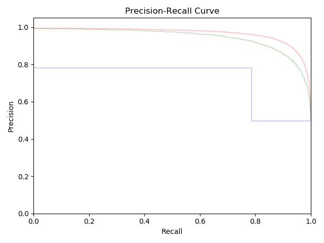
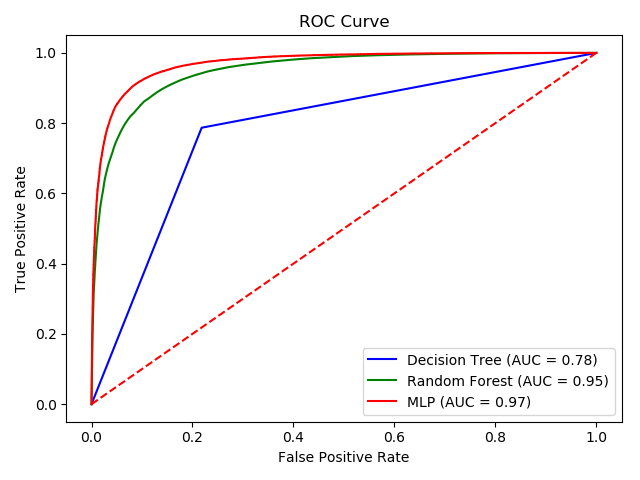

# Sentimental Analysis

This is an implementation of sentimental analysis of Amazon reviews with NLP on Python 2.7 using Scikit-Learn. To analyze Amazon review, first, convert text data into number vectors. This implementation uses three kinds of vectorization technique, such as "Bags of words", "Word to Vector", and hash function. Nextly, train vector data and its label (Positive or Negative) using training algorithm. This tests "Decision Tree", "Rendom Forest", and "Multi Layer Perceptron". Lastly, predict whether the test data is positive or negative.

### Vectorization

Machine learning algorithms have input data as numbers or number vectors. Since Amazon review data are text, it should convert into number vectors. This process is called vectorization. "Bags of words" algorithm generate a list of words and number vectors. A list contains every words which are contained input data. Naturally, it assigns a number to each word in the list such as index of word in a list. Thus, every text sentences could be converted number vectors and its words are mapped corresponding word in the list. This algorithms do not keep order of words. Meanwhile, if it uses hash function instead of "Bags of words", it contains order of words.


### Results




The repository includes:
* Source code
* Test datasets

### [Datasets]

400K Amazon review texts and labeling(Positive or Negative)


### Building Environment
* Python 2.7
* Scikit-learn
* Pandas
* Nltk
* numpy
* BeautifulSoup
* stopwords
* SnowballStemmer

### Run
```bash
$ python BagsOfWords.py
$ python WordToVector.py
$ python OnlineLearning.py
```

### Status

This is the second assignment of CSCI-564 Multimedia System Design, 2018 fall

Version 1.0

